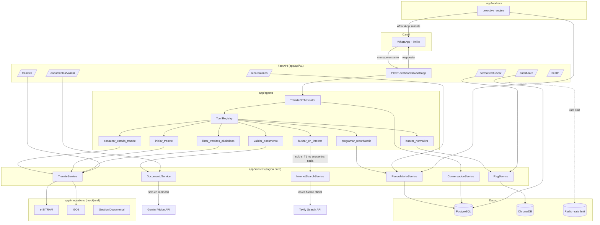

# Arquitectura de AMI Copiloto Backend

## Vision general

AMI Copiloto es un agente conversacional (no un chatbot de preguntas y respuestas)
que atiende ciudadanos por WhatsApp, entiende su objetivo, arma una ruta de tramites
personalizada usando RAG sobre normativa oficial del GAMLP, valida documentos por
foto antes de que el ciudadano viaje a una oficina, inicia tramites contra sistemas
municipales y hace seguimiento proactivo.

## Diagrama de componentes



## Separacion de capas

```
api (HTTP, FastAPI)  ->  services (logica de negocio pura)  ->  db / integrations
```

- `app/api`: valida entrada con Pydantic, traduce excepciones de dominio a HTTP,
  aplica rate limiting y autenticacion JWT. No contiene logica de negocio.
- `app/services`: logica de negocio pura. **No importa nada de FastAPI.** Es la capa
  testeable de forma aislada y reusable tanto desde la API como desde el agente.
- `app/db`: modelos ORM (SQLAlchemy 2.0 async) y sesiones.
- `app/integrations`: unico punto de contacto con sistemas municipales externos,
  siempre via API REST (nunca acceso directo a bases institucionales), con
  interfaz abstracta `MunicipalAPIClient` e implementaciones mock/real intercambiables
  por configuracion (`ESITRAM_MODE=mock|real`).
- `app/agents`: el orquestador del agente y sus tools. Cada tool es un modulo
  independiente registrado en un `ToolRegistry` (patron plugin), de forma que agregar
  nuevos tramites/tools no requiere tocar el loop del agente.
- `app/workers`: jobs de background (motor de proactividad), stateless e idempotentes.

## Flujo tipico: ciudadano pregunta por requisitos

1. Twilio hace `POST /api/v1/webhooks/whatsapp` con el mensaje. Se verifica
   `X-Twilio-Signature` antes de tocar cualquier dato.
2. El webhook persiste el mensaje, arma el historial de la conversacion y llama a
   `TramiteOrchestrator.responder(...)`.
3. El orquestador corre el loop de function calling de Gemini: el modelo decide
   llamar a `buscar_normativa` con la consulta del ciudadano.
4. `RagService` busca en ChromaDB y filtra por `RAG_SIMILARITY_THRESHOLD`. Si no hay
   nada relevante, devuelve `encontrado=false` y el modelo esta forzado (por el
   system prompt) a admitir que no tiene informacion oficial.
5. La respuesta final se persiste como mensaje del agente y se responde al webhook.

## Motor de proactividad

`app/workers/proactive_engine.py` corre un scheduler (APScheduler) que cada
`PROACTIVE_ENGINE_INTERVAL_MINUTES` revisa `recordatorios` vencidos. Cada
recordatorio se reclama con un `UPDATE` condicional (`estado=PENDIENTE ->
ENVIADO`) antes de enviarlo: si dos workers corren en paralelo o el proceso se
reintenta, el segundo `UPDATE` afecta cero filas y no se duplica la notificacion.

## Seguridad (resumen; detalle de decisiones en `decisiones-tecnicas.md`)

- Firma de Twilio verificada en el webhook antes de procesar.
- Rate limiting por IP/telefono respaldado en Redis.
- JWT de acceso corto + refresh token para el dashboard; sin rutas admin abiertas.
- CORS con whitelist explicita de origenes.
- Fotos de documentos procesadas en memoria y descartadas tras la validacion.
- Logging estructurado sin PII (solo metadatos: ids, resultados, timestamps).
- Timeouts + circuit breaker en integraciones municipales.
